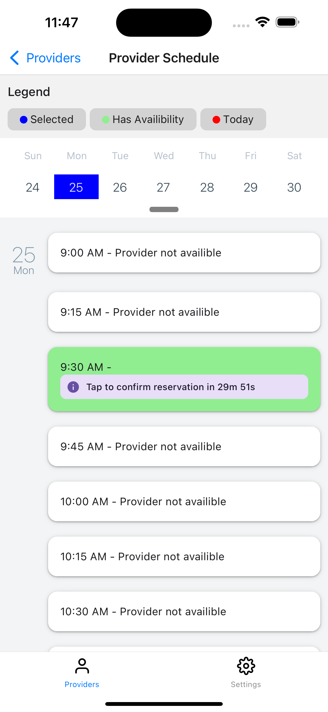
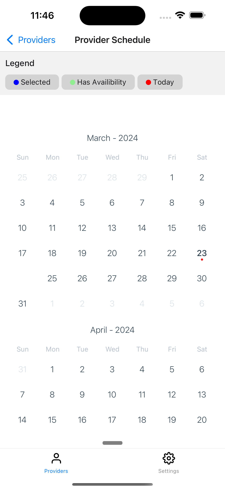

# About

A dual purpose scheduling App for service providers and their clients with local mock api and database. Service providers can mark availibility on a monthly schedule, and their clients can take availible time slots from the specified providers schedule. Clients have 30 minutes to confirm reservations before they are shown to the provider.

  
  

### Software Requirements

- **Node.js**: v18 or higher

### Simulator Requirements

(will have to run on simulator because the mock api is being served on localhost)

- **iOS**: iOS 13.0 or higher.
- **Android**: Android 10 or higher

# Running the App

To run the app on your local development machine, follow these steps:

1. **Open Simulator** Open the xcode or android studio simulator on your machine

2. **Install Dependencies**: run `yarn` in the root directory

3. **Start the App + JSON Server**: run `yarn start-all` to concurrently start the Expo app and the mock api

4. **Download the Expo Go app:** Hit the `i` key to run ios or the `a` key to run android. follow the prompts to install expo go

5. **Viewing the app:** Following the above steps should start the app automatically within expo go. If it doesnt, copy the url in the terminal (should look something like `exp://192.168.4.38:8081`) and paste it manually into the app .

#

⚠️ The react-native-calendars library has some lag on UI updates when refreshing the schedule. please give it a second when performing actions
